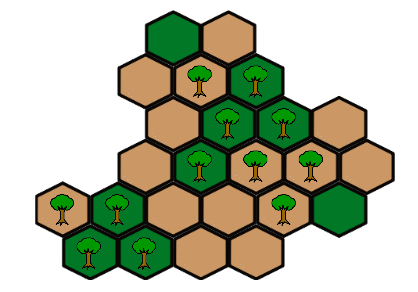

# Post-stratification to improve the efficiency of forestry estimates

This repository contains source code for a Statistics Practicum (MATH 343) project in Spring 2019, advised by [Assistant Professor Kelly McConville](https://github.com/mcconvil) at Reed College.  This work is being done for the U.S. Forest Inventory and Analysis program. The final paper is available as `paper.pdf`.

The National Forest Inventory and Analysis (FIA) Program of the US Forest Service regularly estimates forest attributes such as biomass and trees per acre. These estimates are used in a wide variety of applications, such as policy formulation, scientific analysis, land management, and business plan development. The use of post-stratification in prediction of forest attributes greatly improves the efficiency of these estimates. Current procedures used by the Interior West unit of the FIA involve stratifying by forest, non-forest, and water areas. This project aims to increase the efficiency of estimates by finding a better stratification scheme. We proposed different stratification schemes based on satellite image data, and compared their variance estimates to that of the current stratification scheme. This research builds on the FIA's current stratification scheme, and works to reduce the amount of variation in forest attribute estimation, which can in turn make for more useful and informative analyses.

Authored by [Edwin Alvarado](https://github.com/ealvarado570), [Alex Lloyd-Damnjanovic](https://github.com/alexlloyddamnjanovic), [Miranda Rintoul](https://github.com/MirandaRintoul), and [Mai Toyohara](https://github.com/mtoyohara).